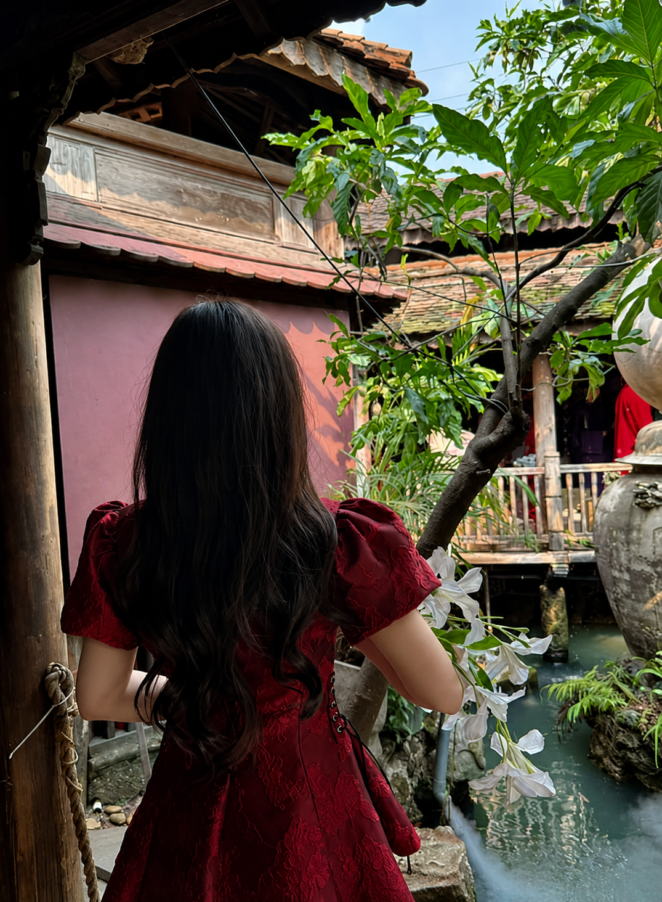

<div align="center">


</div>

---

## 🌷 About Me

```
🌸  Mình là atk_meow — Fullstack Developer yêu đời & yêu code 💖
💻  Đang xây dựng những website vừa xinh vừa mạnh!
🌱  Luôn học hỏi và phát triển mỗi ngày ✨
☕  Không có cà phê thì không có code 🫶
🎀  Thích làm ra những thứ đẹp từ những dòng code
📍  Việt Nam 🇻🇳
```

---

## 🛠️ Ngôn ngữ & Công cụ

<div align="center">

[](https://skillicons.dev)

</div>

---

## 📊 GitHub Stats

<div align="center">


&nbsp;


</div>

---

## 🌸 Contribution Graph

<div align="center">

[](https://github.com/Ashutosh00710/github-readme-activity-graph)

</div>

---

## 💌 Liên hệ với mình

<div align="center">

[](https://tiktok.com/@vuanguzz)
[](https://instagram.com/vuanguzzz)
[](https://facebook.com/YOUR_FACEBOOK)

</div>

## 🎀 Gallery

<div align="center">




</div>

---

<div align="center">


*✨ "Mỗi dòng code là một bước tiến nhỏ — cứ code đi, đừng sợ sai!" 🌸*

<br/>


</div>
